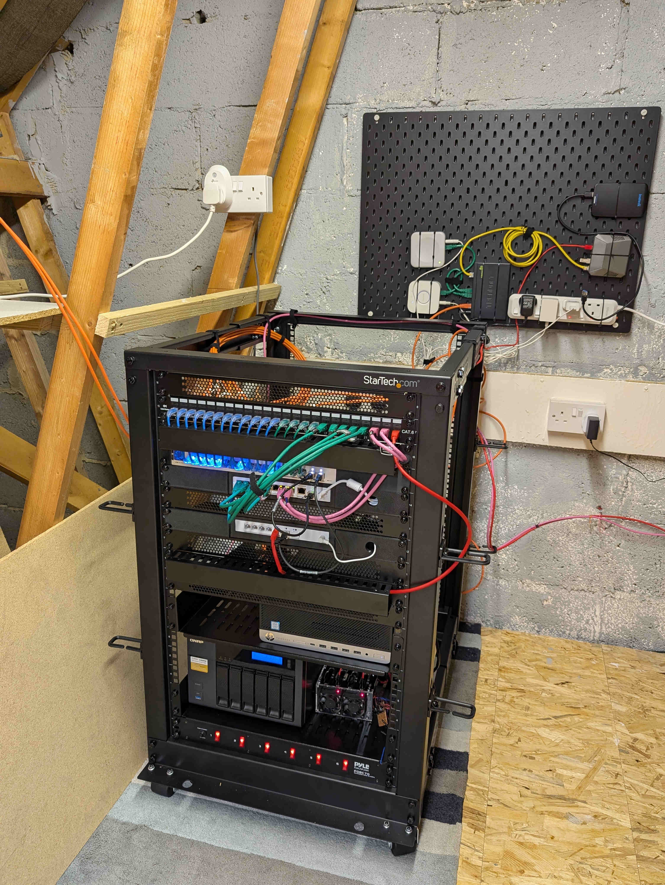

---
date:
  created: 2026-07-15
categories:
  - Architecture
tags:
  - homelab
  - hardware
  - unifi
authors:
  - rubot
---

# Home lab, part 1: hardware and physical setup

When my wife and I moved into our current home seven years ago, I wanted the network gear tucked away in the loft rather than piled up behind the TV. Wiring the house for Ethernet turned out to be a bigger job than I'd expected, and since it wasn't urgent, it kept sliding down the to-do list. That changed last December, when a problem with the existing setup made it worth finally tackling properly. 

<!-- more -->

I'd already looked into MoCA adapters as a stopgap for avoiding a cable run downstairs — the plan was to wire up the loft first, get comfortable with the process, and take on the downstairs run later. From there it became a proper UniFi shopping list: I'd originally planned on a wall-mounted rack but settled on a free-standing StarTech one instead, and after buying a 16-port switch I mistakenly thought was PoE, I ended up adding a second 8-port PoE switch to cover the devices that actually needed it.

This post covers where all of that landed: how the loft gets a wired connection to a room with no easy cable run, and what's actually sitting in the rack. The next one moves up into the network architecture and VLAN segmentation built on top of it.

## Getting a wired connection to the loft

The 18u rack lives in the loft. The ISP connection terminates downstairs, and there was no practical way to run new Ethernet between the two without opening up walls or floors. Rather than resorting to a wireless bridge, I used the existing coax wiring already run through the house: a pair of GoCoax MoCA adapters, one at each end, turns that coax into a wired Ethernet backhaul — one adapter downstairs off the modem, one in the rack, feeding straight into the gateway's WAN port. It's not glamorous, but it means the loft gets a proper wired connection instead of relying on Wi-Fi to bridge the gap, using cabling that was already in the walls.

## The rack

Everything lives in an 18U free-standing StarTech rack:

- **Gateway/firewall** — a UniFi UCG Fiber, doing the routing and firewalling covered in the next post
- **Switching** — a UniFi USW Pro Max 16 as the core switch, plus a UniFi USW Flex 2.5G 8 PoE for PoE devices
- **Storage** — a QNAP NAS
- **Compute** — two servers, covered properly in a later post once I get to the compute layer
- **Patch panel** — a keystone patch panel for terminating runs around the house
- **PDU**, and cable management to keep the above from turning into a rat's nest

{ width="600" }

## What's next

Part 2 covers the network built on top of this hardware: the VLAN layout and the zone-based firewall rules that segment it.
