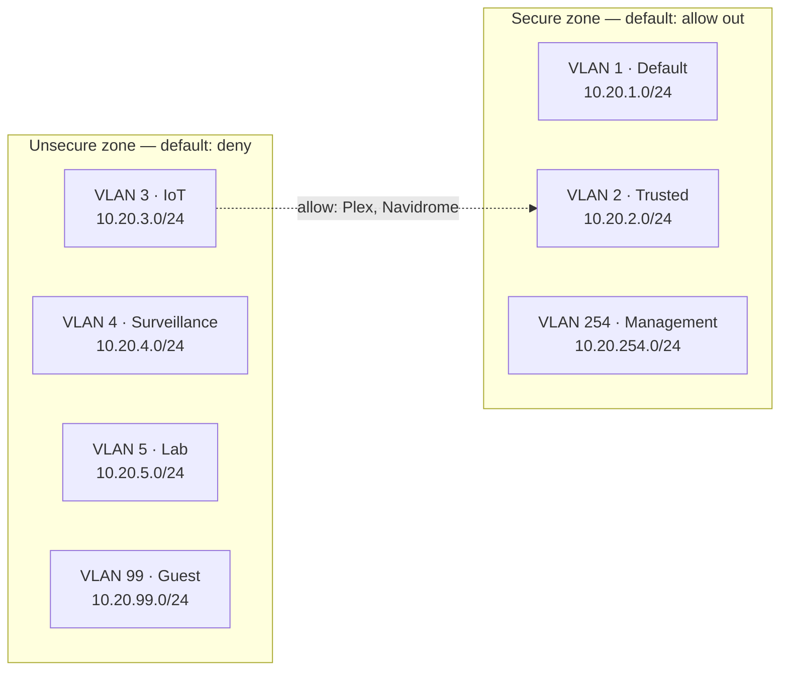

---
date:
  created: 2026-07-17
categories:
  - Architecture
tags:
  - homelab
  - networking
  - unifi
authors:
  - rubot
draft: false
---

# Home lab, part 2: network architecture and VLAN segmentation

[Part 1](../home-lab-part-1-hardware-and-physical-setup/) covered the physical layer — where the gear lives and how it gets a wired connection. This post covers what's built on top of it: the gateway, the VLAN layout, and the firewall model that ties them together. Later posts move up the stack into the compute layer and the reverse proxy sitting in front of it.

<!-- more -->

!!! note "On the numbers in this post"
    Subnets below are placeholders (`10.20.x.0/24`, where `x` mirrors the VLAN ID) rather than what's actually configured. The structure is real; the octets aren't.

## Topology at a glance

Everything terminates on a single UniFi UCG Fiber, acting as router, firewall, and controller for the rest of the UniFi gear downstream. One gateway, one choke point, one place to reason about policy — deliberately, rather than spreading routing and firewalling across multiple boxes.

The high-level layout and any config notes for this setup live in the [`homelab` repo](https://github.com/rubot99/homelab) if you want to dig further than this write-up goes.

## Seven VLANs, seven trust levels

| VLAN | Name | Subnet (redacted) | Purpose |
|---|---|---|---|
| 1 | Default | `10.20.1.0/24` | Catch-all for anything not explicitly placed elsewhere |
| 2 | Trusted | `10.20.2.0/24` | Personal devices — laptops, phones, and the services I access directly, like Plex and Navidrome |
| 3 | IoT | `10.20.3.0/24` | Smart home devices, plus casting hardware (Chromecasts, Fire Sticks) |
| 4 | Surveillance | `10.20.4.0/24` | Cameras and recording infrastructure |
| 5 | Lab | `10.20.5.0/24` | Home-lab compute — covered in the next post |
| 99 | Guest | `10.20.99.0/24` | Visitor devices |
| 254 | Management | `10.20.254.0/24` | Switches, APs, and the UDM's own management plane |

The split isn't arbitrary. Each VLAN groups devices with roughly the same trust level and the same blast radius if something on it gets compromised — a smart plug and a security camera have very different failure modes, and I'd rather not find that out the hard way by having them share a broadcast domain with anything that matters.

## Zones, not forty-two point-to-point rules

Seven VLANs means up to 42 directional pairs if you write inter-VLAN rules one at a time. UniFi's zone-based firewall collapses that into two policy domains instead:

- **Secure zone** — Default, Trusted, Management. Devices here are ones I physically control and generally trust to initiate outbound connections.
- **Unsecure zone** — IoT, Surveillance, Lab, Guest. Default policy is deny, both into the Secure zone and between networks inside this zone. Anything crossing that boundary needs an explicit rule.

The default-deny posture means a compromised smart plug on the IoT VLAN can't casually port-scan its way into Management or Lab — it has no route there unless a rule says otherwise. Writing policy at the zone level rather than per-VLAN also means adding an eighth or ninth network later doesn't require re-deriving the whole rule set; it just gets dropped into whichever zone matches its trust level.

## The one deliberate hole: casting to Plex and Navidrome

Plex and Navidrome run on the Trusted VLAN, in the Secure zone. Chromecasts and Fire Sticks live on IoT, in the Unsecure zone — they're consumer devices running vendor firmware I don't control, so they belong there, not on Trusted. Left alone, the default-deny rule between zones would block casting entirely, since a Chromecast starting a stream needs to reach Plex directly.

Rather than either moving the casting hardware onto Trusted (which defeats the point of having an IoT boundary) or opening IoT → Trusted wholesale (same problem, worse), the fix is a single scoped allow rule: source IoT, destination the specific Trusted hosts running Plex and Navidrome, limited to the ports those two services actually listen on. Casting works, and IoT devices still can't reach anything else on Trusted, or anything at all on Management or Lab.

It's a small rule, but it's the shape every future exception should take: narrow enough that granting it doesn't quietly widen the zone boundary it's punching through.

## Coming up next

Part 3 moves into the Lab VLAN itself — what's actually running there, and why it sits in the Unsecure zone alongside IoT and guest traffic rather than next to Trusted. Part 4 covers the reverse proxy that decides what, if anything, gets exposed beyond the lab network at all.
