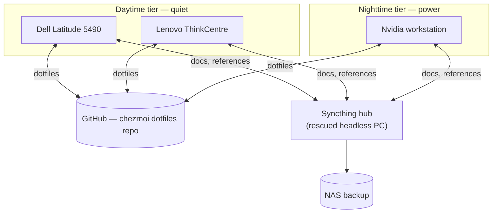

---
date:
  created: 2026-07-20
categories:
  - Development
tags:
  - linux
  - open-source
  - zsh
  - podman
  - chezmoi
  - git
authors:
  - rubot
draft: true
---

# The Asymmetric Dev, part 2: the tooling bridge and unified environment

Choosing Zorin OS Core across my entire three-machine mesh solved my initial operating system crisis. I finally had a unified, macOS-like GNOME desktop layout on my old Dell Latitude laptop, my low-powered ThinkCentre mini PC, and my high-spec Nvidia workstation.

<!-- more -->

But a consistent user interface is just a coat of paint. The real challenge of an asymmetric, multi-machine setup lies beneath the surface: **environment parity**.

How do you guarantee that a terminal command executed on a low-power day machine behaves exactly the same way during a midnight coding session on a workstation? How do you prevent configuration drift when your hardware spans different generations of silicon? Manual configuration across three systems is an engineering sin — to make this distributed workspace function as a single, cohesive engine, I had to build a deterministic tooling bridge.

## Architecture at a glance

## The configuration anchor: chezmoi, Zsh, and Starship

The foundational layer of my ecosystem is dotfile management. To replicate the fluid terminal experience I fell in love with on Apple Silicon, I immediately swapped out the default Bash shell for **Zsh**, paired with the incredibly fast, cross-shell **Starship prompt**.

Now, whether I am on the low-spec mini PC or the main workstation, my shell looks, feels, and reacts identically. But if I change a shell alias, an environment variable, or an editor preference on one machine, I need that change to instantly replicate across the other two.

I settled on **chezmoi** backed by a private GitHub repository.

Unlike primitive symlink scripts that break across different architectures, chezmoi treats configurations as code. It acts as a secure, version-controlled manager for your home directory. By pushing my dotfiles to GitHub, provisioning a new machine or updating an existing one becomes completely deterministic. I don't spend hours tweaking configurations; I pull my latest commits via chezmoi, and my environment instantly snaps into place.

## Bypassing the LTS bottleneck: mise, uv, and Homebrew

One of the trade-offs I accepted with Zorin OS was its underlying Ubuntu LTS base. LTS means rock-solid, production-grade stability — but it also means the system's built-in package manager (APT) serves older, slower-moving toolchains.

As a developer, I need bleeding-edge tools. I want the fast-moving runtimes I enjoyed on macOS. To solve this, I completely decoupled my operating system from my development tooling by leveraging three modern user-space package managers:

- **mise:** instead of fighting system-wide runtimes, I use mise to dynamically manage language engines (like Node.js and .NET). It allows me to switch language versions per project seamlessly, entirely isolated from Zorin's underlying system libraries.
- **uv:** for Python development, uv is a revelation. It replaces legacy, sluggish package tools with an incredibly fast, modern Python toolchain manager. It handles virtual environments and dependency locking instantly, bringing elite-level speed to my older hardware.
- **Homebrew for Linux:** to bring the Mac developer experience full circle, I installed Homebrew. This allows me to pull down the exact same, up-to-date CLI utilities I use on my work MacBook Air, bypassing stale system repositories entirely.

## Modern containerization: learning Podman

Part of the joy of migrating to Linux is using it as an opportunity to upskill. While my central homelab environment still runs traditional Docker, I decided to deploy **Podman** on my local development machines.

As a drop-in replacement for Docker, Podman offers a massive architectural advantage: it is **rootless** by default. It doesn't rely on a privileged system daemon always running in the background. For an asymmetric setup utilizing lower-powered hardware like my ThinkCentre mini PC, Podman's lighter footprint and enhanced security model make it the perfect container engine for local development.

## Separation of concerns: the data layer

With my configurations anchored by chezmoi and my binaries managed by mise, the final piece of the puzzle was handling data. Many developers default to commercial cloud storage or massive mesh syncs for everything. I took a strict, intentional approach to separation of concerns:

### The code: Git

Active development folders and source code *never* touch a synchronization service. I stick purely to standard command-line Git and the native Git tooling built into VS Code, pushing straight to GitHub. This ensures that code states are tied entirely to repository commits, eliminating the risk of compilation race conditions, lockfile conflicts, or corrupt build artifacts across machines.

### The context: Syncthing

For everything else — documentation, reference materials, cheat sheets, and technical images — I deployed **Syncthing**.

Instead of trusting third-party cloud brokers, I configured a self-hosted local mesh. I repurposed a fourth piece of rescued hardware: an old, headless PC running Ubuntu Server (which I cover in my [homelab posts](../home-lab-part-1-hardware-and-physical-setup/)) to act as a central hub. Syncthing continuously syncs my reference files across the laptop, mini PC, and workstation completely peer-to-peer, automatically backing up to a local NAS device.

## The IDE split: tuning to the silicon

The final architectural decision was matching my development tools to the underlying hardware capabilities. My daytime environments require absolute quiet to share a workspace with my wife, while my evening workstation provides raw computing power.

Rather than forcing heavy IDE workloads onto old silicon, I split my workflows logically:

!!! tip "The IDE split: day shift vs night shift"
    - **The day shift (Latitude & ThinkCentre):** running **VS Code**. It's lightweight, fast, and perfect for reviewing documentation, writing scripts, or knocking out web tasks on low-power, silent machines using built-in Git integrations.
    - **The night shift (workstation):** running **JetBrains Rider**. When it's time for heavy-duty, multi-threaded cross-platform .NET backend engineering, I switch to the workstation where the hardware can comfortably handle Rider's deep static analysis and heavy indexing engines.

By designing the environment around the hardware's strengths rather than pretending all three machines are identical, I turned a mismatched pile of potential e-waste into a highly optimized, resilient, local developer cloud.
