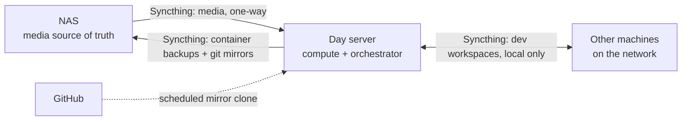

---
date:
  created: 2026-08-13
categories:
  - Homelab
tags:
  - homelab
  - storage
  - backups
  - syncthing
authors:
  - rubot
draft: false
---

# Home lab, part 5: splitting storage from compute

[Part 4](../home-lab-part-4-self-hosted-media-services/) covered the four apps running on the day server and mentioned, in passing, that the NAS is the source of truth for media and the day server works from a local copy. This post is the rest of that story: why the NAS used to run those apps itself, why that stopped working, and what the day server's job has quietly grown into since.

<!-- more -->

## The NAS used to run the media apps itself

Before any of this landed on the day server from [Part 3](../home-lab-part-3-from-proxmox-to-bare-metal-docker/), the QNAP NAS ran the media stack directly, via Container Station, against its own storage. It made a certain sense on paper — the media lives there, so run the apps there too, and skip a hop.

It didn't hold up in practice. Plex transcoding a stream is a CPU-bound job, and the NAS's CPU is built for storage throughput, not compute — it was struggling even with files that were already prepared for transcoding, let alone anything more demanding. The NAS is good at being a NAS. It was never going to be good at being a compute box, for the same reason Part 3's Proxmox hosts were never going to earn their keep running one VM each: the hardware was shaped for a different job than the one I was asking it to do.

## Storage and compute are different jobs

The fix was the same shape of fix as Part 3, applied one layer down: stop asking one box to do two jobs it isn't suited for at once. The NAS went back to being purely storage — the authoritative copy of the media library and the thing backups point at. The day server took over running the apps, working from a **local copy** of the media rather than the NAS's live storage, so transcoding load never touches the NAS at all.

The NAS keeps that local copy fresh itself: it runs Syncthing as a container and pushes media to the day server on a one-way sync. The NAS is authoritative; the day server's copy is a mirror, not a second source of truth.

## The day server turned into more than a media box

Once the day server was the box with spare compute and a Syncthing peer relationship already in place with the NAS, it picked up jobs that had nothing to do with media:

- **Container backups.** A scheduled script backs up container volumes and compose configs to an NFS share hosted on the day server itself — containers are still run by hand with `docker compose`, not yet through Dockhand, but the backup side is already automated.
- **Git repo backups.** A scheduled script keeps mirror clones of GitHub repos and local-only repos (ones that never leave the network) on the day server.
- **Cross-machine workspace sync.** Working project and dev folders sync between the day server and other machines on the network, hub-and-spoke through the day server via Syncthing, and it never leaves the local network.

The container backups and the git mirrors both then sync onward to the NAS over that same Syncthing relationship — so the NAS ends up holding a second copy of the day server's backups, the same way the day server holds a mirror of the NAS's media.

## The overnight shutdown didn't survive this

Part 3 described the day server going to sleep overnight on a cron job, since it only needed to be up for Plex and the other day-only services. That schedule is gone. A box that's the Syncthing hub for another machine's workspace files, the target for scheduled backup and mirror jobs, and the live copy of the media library can't disappear for eight hours without everything downstream of it stalling. The day server runs continuously now — not because I decided uptime mattered more, but because the jobs it accumulated made the overnight gap a liability rather than a free scheduling win.

## Where that leaves the two boxes

- **NAS** — storage and backup only. Authoritative for media, and a second copy of the day server's own backups. No compute.
- **Day server** — compute and orchestration. Runs the media apps against a local mirror, backs up its own containers and git repos, and is the sync hub for workspace files across the network.

Neither box does the other's job anymore, which was the whole point.

## Coming up next

Part 6 covers the reverse proxy — what it takes to expose any of this beyond the Lab VLAN, and what I'm choosing to expose versus keep internal-only.
